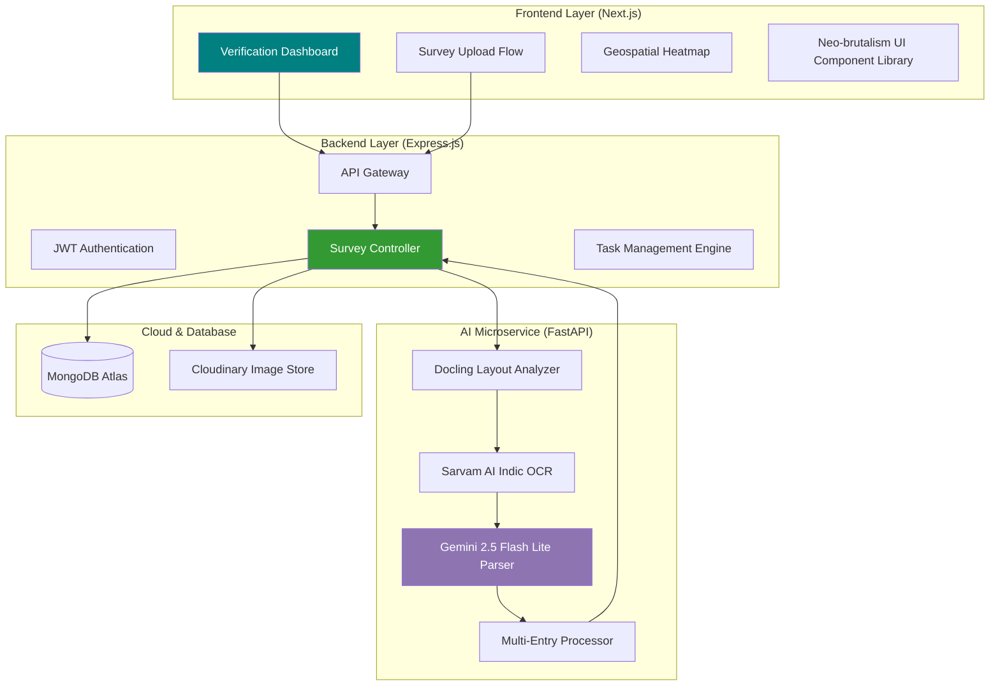
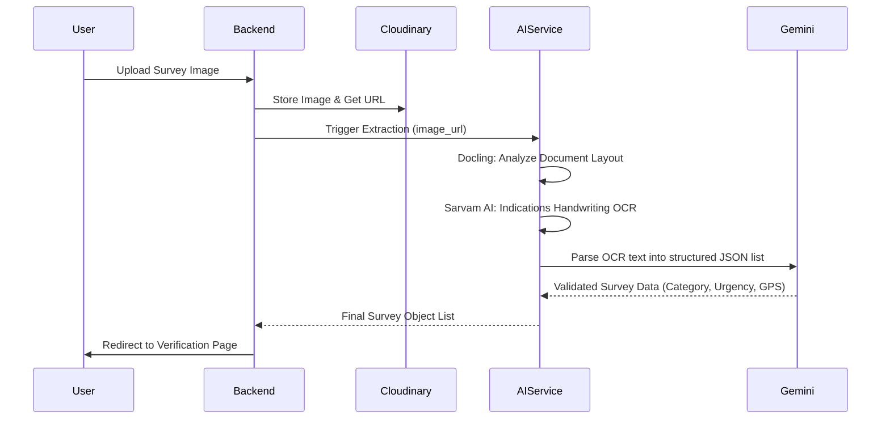
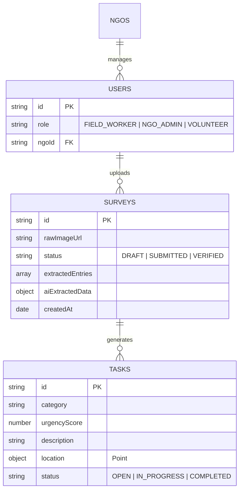

# NexusImpact

## [Project Overview]

> An advanced, AI-powered community response platform designed to bridge the gap between offline field surveys and digital crisis management through intelligent document digitization and geospatial analysis.

[](https://nextjs.org/)
[](https://nodejs.org/)
[](https://fastapi.tiangolo.com/)
[](https://www.mongodb.com/)
[](https://cloudinary.com/)

## Overview

NexusImpact is a comprehensive solution for NGOs and community responders to digitize handwritten field surveys at scale. By leveraging a multimodal AI pipeline, the platform converts physical survey forms into structured, actionable data points, complete with geospatial coordinates and urgency scoring.

### Core Features

- **Multi-Entry AI Digitization** - Automatically identifies and extracts multiple survey records from a single document or image.
- **Handwriting OCR** - Specialized Indic-language handwriting recognition powered by Sarvam AI and Docling.
- **Geospatial Heatmaps** - Real-time visualization of community needs categorized by urgency and location.
- **Verification Workflow** - Dual-pane review interface allowing human-in-the-loop validation of AI-extracted data.
- **Automated Task Creation** - One-click conversion of verified surveys into actionable response tasks for volunteers.
- **Cloud Infrastructure** - Robust document storage and management using Cloudinary.

## Architecture



## AI Pipeline Flow

The platform employs a sophisticated three-stage pipeline to handle complex handwritten documents:



### AI Capabilities

**Indic Handwriting Intelligence**
- Support for multiple regional languages including Hindi and local dialects.
- Advanced layout analysis to distinguish between headers, labels, and handwritten content.

**Multi-Entry Extraction**
- Detects recurring patterns in documents to identify separate survey entries.
- Automatically normalizes coordinates (Latitude/Longitude) found in text.

## Database Schema



## Tech Stack

### Frontend
- **Next.js 14** (App Router)
- **Tailwind CSS** (Neo-brutalism design system)
- **Leaflet & Recharts** (Visualization)
- **Lucide React** (Iconography)

### Backend
- **Node.js & Express**
- **MongoDB & Mongoose**
- **Cloudinary SDK** (Media Management)
- **Socket.io** (Real-time updates)

### AI Service
- **Python 3.10+**
- **FastAPI**
- **Docling** (Document Layout)
- **Sarvam AI SDK** (OCR)
- **Google Generative AI** (Gemini 1.5)

## Installation & Setup

### Prerequisites
- Node.js 18+
- Python 3.10+
- MongoDB instance
- Cloudinary Account
- Google Gemini API Key
- Sarvam AI API Key

### Environment Configuration

**Backend (`apps/backend/.env`)**
```bash
PORT=5000
MONGODB_URI="your_mongodb_uri"
JWT_SECRET="your_secret"
CLOUDINARY_CLOUD_NAME="your_name"
CLOUDINARY_API_KEY="your_key"
CLOUDINARY_API_SECRET="your_secret"
AI_SERVICE_URL="http://localhost:8000"
```

**AI Service (`apps/ai-service/.env`)**
```bash
GEMINI_API_KEY="your_google_key"
SARVAM_API_KEY="your_sarvam_key"
PORT=8000
```

### Execution Steps

```bash
# 1. Start the AI Service
cd apps/ai-service
python -m venv venv
source venv/bin/activate # or venv\Scripts\activate on Windows
pip install -r requirements.txt
uvicorn main:app --reload --port 8000

# 2. Start the Backend
cd ../backend
npm install
npm run dev

# 3. Start the Frontend
cd ../frontend
npm install
npm run dev
```
